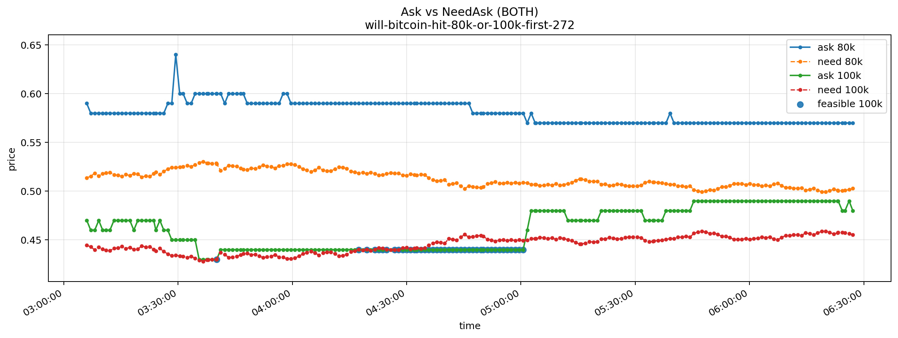

# PolymarketArbitrageMoments

<p align="center">
  
</p>

<p align="center">
  <em>
    Ask vs NeedAsk over time for Polymarket BTC threshold markets.
    Points highlight moments where the hedge is feasible (ask ≤ need ask),
    meaning the position is non-negative in both WIN and LOSE scenarios.
  </em>
</p>

---

## 🔍 What this is

**PolymarketArbitrageMoments** is a real-time scanner for Polymarket Bitcoin threshold markets  
(e.g. *“Will Bitcoin hit 80k or 100k first?”*).
(e.g. *“Will Bitcoin hit 80k or 150k first?”*).

The tool continuously compares:
- **Polymarket outcome prices** (best bid / best ask),
- against a dynamically computed **required ask** (“NeedAsk”),
- derived from hedging the position with **Binance BTCUSDT futures**.

When the market ask drops **below** the required hedge threshold, the setup becomes feasible:
- **WIN** outcome ≈ hedged to zero  
- **LOSE** outcome ≥ target profit (`--target_plus`)

---

## 📈 What the graph shows

- **ask X** — current best ask on Polymarket for outcome `X`
- **need X** — maximum ask price at which the hedge still satisfies the target constraint
- **feasible X** — moments where `ask ≤ need`, i.e. the hedge is mathematically valid
- X-axis shows real time as the script runs (`--interval`)

Graphs are collected in **graph mode** and saved as PNG snapshots.

---
##📊 Graph mode controls

Ctrl+C once → save PNG graphs for each URL and continue running

Ctrl+C twice → exit the program

---

## 🚀 Quick usage example

```bash
python main.py live \
  --url "https://polymarket.com/event/will-bitcoin-hit-80k-or-100k-first-272" \
  --url "https://polymarket.com/event/will-bitcoin-hit-80k-or-150k-first" \
  --outcome "100k" \
  --stake 100 \
  --target_plus 10 \
  --interval 10 \
  --both \
  --graph \
  --png_prefix "graphs/graph"


  
